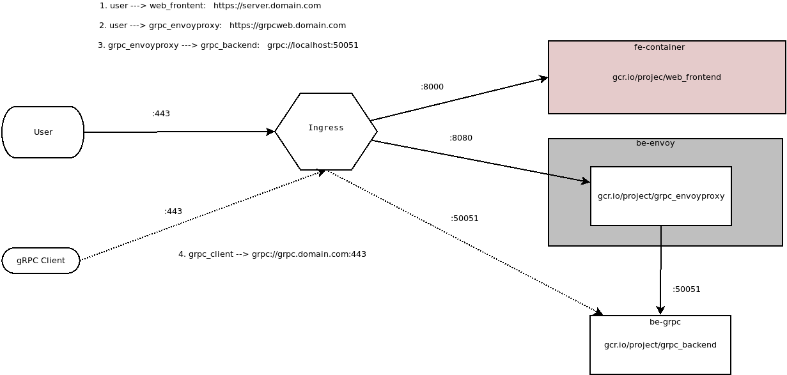
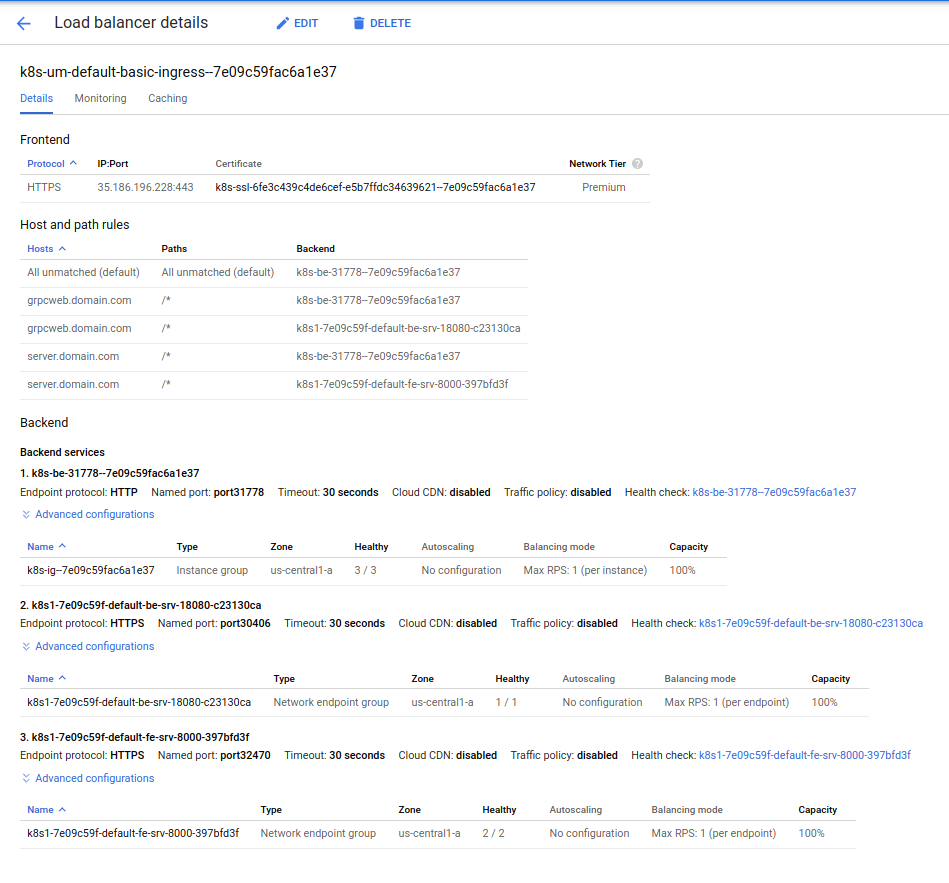

#  gRPC over browser Javascript: Using gRPC-Web on Google Kubernetes Engine Ingress


[grpc-web](https://github.com/grpc/grpc-web) offers a way to access your [gRPC](https://grpc.io/) API server from a modern browser.  Normally, API servers you call directly from browsers is plain `REST`...but its not well known that you can also call gRPC directly without involving [transcoding](https://github.com/grpc-ecosystem/grpc-httpjson-transcoding) or REST but a modification of the standard gRPC wire protocol adapted to account for browser limitations.  

So last wee i wanted to create a simple helloworld app for grpcWeb and succeded in doing that direclty on my laptop (you can see that sample [here](https://github.com/salrashid123/gcegrpc/tree/master/grpc-web).  As a further extension, I endedup adapting that sample sample to run on GKE direclty with its HTTP/2 Ingress resource capability.  That is, this sample deploys a simple webapp which from the browser calls a gRPC server!

The basic flow for this app would be:

1. browser requests a plain HTML page from a webserver on GKE (externally exposed via Ingress)
2. webserver responds back with html page including some javascript w/ grpc Client code
4. browser then issues grpc-web API call to the same Ingress endpoint but routed towards an Envoy proxy backend
5. envoy forwards gRPC request to your backend gRPC server over true `grpc://`
6. backend API responds back to request with unary or streamed response.

As a bonus, this sample also exposes the gRPC server's port directly.  This allows ordinary gRPC clients written in any language to connect and issue API requests.

- 


>> Please note, if all you need to do is grpc+ingress+gke, please see [exapmple grpcIngress deployment](https://github.com/GoogleCloudPlatform/gke-networking-recipes/tree/master/ingress/single-cluster/ingress-custom-grpc-health-check/example)

You can read more about gRPC and gRPC-web in the references cited below.

## gRPC Transcoding vs gRPC Web vs gRPC Native

gRPC web should not be confused with gRPC Transcoding:  the former is a modification of gRPC protocol adapted for a browser (i.,e try to use `application/grpc` framing and separate out the `HTTP/2` framing not exposed to browsers).  Transcoding is a server-side capability that converts an inbound REST message into a backend gRPC request.

For more information, see [Protocol differences vs gRPC over HTTP2](https://github.com/grpc/grpc/blob/master/doc/PROTOCOL-WEB.md#protocol-differences-vs-grpc-over-http2)


Google Cloud Enpoints supports this type of transcoding via annotations as described here
 -[https://cloud.google.com/endpoints/docs/grpc/about-grpc](https://cloud.google.com/endpoints/docs/grpc/about-grpc)
 -[https://cloud.google.com/endpoints/docs/grpc/transcoding](https://cloud.google.com/endpoints/docs/grpc/transcoding)

Here is an example hello-world app for gRPCTranscoding using Cloud Endpoints
- [Google Cloud Endpoints: REST and gRPC, gRPC+Transcoding](https://github.com/salrashid123/esp_docker)


## Cloud Endpoints support for gRPC-Web

  The example in this repo utilizes Envoy.  You can also use Google Cloud Endpoint's ESP proxy which provides basic grpc-web support in addition to other features/capabilities of Endpoints like API management.

- [https://github.com/cloudendpoints/esp/blob/master/CHANGELOG.md#release-1100-24-10-2017](https://github.com/cloudendpoints/esp/blob/master/CHANGELOG.md#release-1100-24-10-2017)


## GKE-Ingress HealthCheck workarounds

`Update: 12/16/19`:  Google GKE Ingress enables HTTP-based healthchecks against the `Serving Port` of the target GKE service:

- [Custom health check configuration](https://cloud.google.com/kubernetes-engine/docs/how-to/ingress-features#direct_health)
The BackendConfig makes the workarounds using mux and envoy described  in this repo obsolete but you still need an a POD that proxies HTTP healthcheck requests....thats a todo for me to update this repo...

`Update 6/26/21`:   GCP now support a BackendConfig that supports independent HealthChecks over HTTP that Ingress understands:

  The default architecture above shows how you can also connect directly to the grpc service as it runs internally.  The ability to connect directly is not the focus of this article so I've left theat configuration commented out.  If you wanted to expose the gRPC service externally as well, please account for the healthchecks as described here:
  * [https://github.com/salrashid123/gcegrpc/tree/master/gke_ingress_lb](https://github.com/salrashid123/gcegrpc/tree/master/gke_ingress_lb)   

  - [Ingress-gce PR#807](https://github.com/kubernetes/ingress-gce/pull/807)

`Update 12/24/21`: 
    Fixed broken nodejs and GKE configurations to account for `HealthChecks` and `BackendConfig`.  Confirmed working on GKE

## Setup

Anyway, if you are still interested:

### Allocate StaticIP

 This step isn't necessary but use statically bound the name `gke-web-ingress` to the Ingress objects later

```
gcloud compute addresses create gke-web-ingress --global

gcloud compute addresses list
NAME             REGION  ADDRESS        STATUS
gke-web-ingress          35.241.41.138  RESERVED
```

### Edit /etc/hosts

Since this is just a demo/POC, statically set the IP to resolve to `.domain.com` as shown below

```
/etc/hosts
35.241.41.138 server.domain.com grpcweb.domain.com grpc.domain.com
```


### Create the GKE cluster

```
gcloud container  clusters create grpc-cluster --machine-type "n1-standard-1"  --zone us-central1-a  --num-nodes 3 --enable-ip-alias
```


### Build Components

You can either build ad upload the images to dockerhub or to your own Container Registry (`gcr.io/project...`).

If you choose to use the images I created and uploaded, skip this section to the "Deploy" part.


#### gRPC Backend

The gRPC backend is a golang app that simply Echo's back a message as Unary or Server Streaming (i.,e echo back the message three times).

There is the proto:

```proto
syntax = "proto3";

package echo;

service EchoServer {
  rpc SayHello (EchoRequest) returns (EchoReply) {}
  rpc SayHelloStream(EchoRequest) returns (stream EchoReply) {}  
}

message EchoRequest {
  string name = 1;
}

message EchoReply {
  string message = 1;
}
```


You can either build the backend or use the one I uploaded here:
 - [gcesamples](https://github.com/salrashid123/gcegrpc/tree/master/app)

- `docker.io/salrashid123/grpc_backend`

To build, git clone the repos above

```
cd backend_grpc
docker build -t your_registry/grpc_backend .
```

to run locally,
```
 docker run  -p 50051:50051 -t salrashid123/grpc_backend ./grpc_server -grpcport 0.0.0.0:50051
```

```
docker run --net=host --add-host grpc.domain.com:127.0.0.1 -t salrashid123/grpc_backend /grpc_client --host grpc.domain.com:50051
```

#### Frontend

You can either build the backend or use the one I uploaded here

- `docker.io/salrashid123/web_frontend`

```
cd frontend
docker build -t your_registry/web_frontend .
```

The frontend listens on port `:8000` so to run it localy, execute something like:

```
docker run -p 8000:8000 salrashid123/web_frontend
```

#### Envoy

You can either build the envoyproxy container or use the one I uploaded here

- `docker.io/salrashid123/grpc_envoyproxy`

```
cd backend_envoy
docker build -t your_registry/grpc_envoyproxy .
```

The grpc_proxy listens on port `:18080`. You can run it locally within a docker file but you'll need to network it with a backend to use it easily.


## Deploy


If you choose to use the images I uploaded, just run:

```
cd gke_config/
kubectl apply -f .
```

Otherwise, edit each yaml file under `gke_config/` folder and change the image reference to your registry.


Once you deploy, you should see the deploymets and the staticIP attached to the Ingress object:

```bash
$ kubectl get po,rc,svc,ing,deployments,secrets
NAME                                      READY   STATUS    RESTARTS   AGE
pod/be-deployment-86c95c96d9-7wlmr        1/1     Running   0          2m58s
pod/be-grpc-deployment-5b97d84c56-mnqxc   1/1     Running   0          2m58s
pod/fe-deployment-d9c6b559f-6b79p         1/1     Running   0          2m57s
pod/fe-deployment-d9c6b559f-gxqt9         1/1     Running   0          2m57s

NAME                  TYPE        CLUSTER-IP   EXTERNAL-IP   PORT(S)           AGE
service/be-srv        NodePort    10.0.7.254   <none>        18080:30406/TCP   2m58s <<<<<< Envoy
service/be-srv-grpc   ClusterIP   10.0.6.44    <none>        50051/TCP         2m58s <<<<<< gRPC Service
service/fe-srv        NodePort    10.0.2.189   <none>        8000:32470/TCP    2m57s <<<<<< Frontend
service/kubernetes    ClusterIP   10.0.0.1     <none>        443/TCP           17h

NAME                               HOSTS                                  ADDRESS          PORTS     AGE
ingress.extensions/basic-ingress   server.domain.com,grpcweb.domain.com   35.241.41.138    80, 443   2m59s

NAME                                       READY   UP-TO-DATE   AVAILABLE   AGE
deployment.extensions/be-deployment        1/1     1            1           2m59s
deployment.extensions/be-grpc-deployment   1/1     1            1           2m59s
deployment.extensions/fe-deployment        2/2     2            2           2m58s

NAME                         TYPE                                  DATA   AGE
secret/default-token-rtv7m   kubernetes.io/service-account-token   3      17h
secret/fe-secret             Opaque                                2      2m58s
```

> *NOTE:* Deployment and availability of the endpoint IP may take `8->10minutes`



Side note, envoy is configured for CORS

```bash
curl -v --cacert CA_crt.pem -H "Origin: https://server.domain.com" \
   -H "Access-Control-Request-Method: GET"  \
   -H "Access-Control-Request-Headers: Authorization, X-grpc-web" \
   -H "host: grpcweb.domain.com" -X OPTIONS  https://grpcweb.domain.com/echo.EchoServer

< HTTP/1.1 200 OK
< access-control-allow-origin: https://server.domain.com
< access-control-allow-methods: GET, PUT, DELETE, POST, OPTIONS
< access-control-allow-headers: keep-alive,user-agent,cache-control,content-type,content-transfer-encoding,custom-header-1,x-accept-content-transfer-encoding,x-accept-response-streaming,x-user-agent,x-grpc-web
< access-control-expose-headers: custom-header-1,grpc-status,grpc-message
```

## Browser

Trust the `CA_crt.pem` file in Firefox since its self-singed.  Open up `Firefox` and under the Advanced settings, enable trust for the CA (you don't have to but its easier this way)

- 


Now go to `https://server.domain.com/`.  You should see the nodejs Frontend,  You may wan to open up developer tools to see the request/response streams

Click the `Submit` button.  WHat that will do is transmit 1 unary request and 1 server-streaming request.  The unary request will respond back with the hostname that handled the request.   Below that you should see three RPC responses back from the server request.


Here is a sample Request-Response from the browser

- Request
```
Host: grpcweb.domain.com
User-Agent: Mozilla/5.0 (X11; Linux x86_64; rv:52.0) Gecko/20100101 Firefox/52.0
Accept: application/grpc-web-text
Accept-Language: en-US,en;q=0.5
Accept-Encoding: gzip, deflate, br
Referer: https://server.domain.com/
custom-header-1: value1
Content-Type: application/grpc-web-text
X-User-Agent: grpc-web-javascript/0.1
X-Grpc-Web: 1
Content-Length: 56
Origin: https://server.domain.com
Connection: keep-alive
```

- Response
```
Access-Control-Allow-Origin: https://server.domain.com
Alt-Svc: clear
Content-Type: application/grpc-web-text+proto
Date: Mon, 03 Sep 2018 18:04:28 GMT
Server: envoy
Via: 1.1 google
X-Firefox-Spdy: h2
access-control-expose-headers: custom-header-1,grpc-status,grpc-message
rpcheaderkey: val
x-envoy-upstream-service-time: 0
```

- 


## gRPC Client

>>> Update 12/25/21:  for ingress+grpc on GKE, please just use
[https://github.com/GoogleCloudPlatform/gke-networking-recipes/tree/master/ingress/single-cluster/ingress-custom-grpc-health-check/example](https://github.com/GoogleCloudPlatform/gke-networking-recipes/tree/master/ingress/single-cluster/ingress-custom-grpc-health-check/example)


## Conclusion

`gRPC-web` and `gRPC` offers many advantages to API developers thats inherent in the protocol and toolchains.  Before you jump in, please read through what you actually need/want from your API and clients.  Often enough, for low-intensity APIs or simple clients, `REST` is a perfectly fine to use (easy to use, easy to setup; widespread support, etc)...it just depends on your current and future needs.

Also, the healthcheck limitations described above makes it much more challenging to deploy in a practical sense at the moment.

Anyway, hope this article helps bridge some the gaps and shows how you can use `grpc-web` on GKE.  You ofcourse do not need to use GKE...take a look at the examples in the reference section below to get started locally or on any platform.

## References

Some other References you maybe interested in:

- [gRPC-web "helloworld"](https://github.com/salrashid123/gcegrpc/tree/master/grpc-web)
- [gRPC with curl](https://github.com/salrashid123/grpc_curl)

